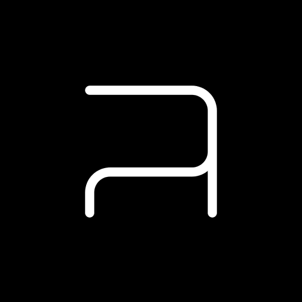

# ORCΛ SEΛFLΛKE



Orca Seaflake is a modified desktop build of [Orca](https://github.com/hundredrabbits/Orca), the esoteric programming language for quickly creating procedural sequencers. Each letter is an operation: lowercase operators run on bang, while uppercase operators run each frame.

Orca Seaflake is a **livecoding environment**, not a synthesizer. It sends MIDI, OSC, and UDP to audio and visual software or hardware, and includes probability, phase, burst, tuned-note, binary-scale, and shaped MIDI-sequence operators.

- [Download installers](https://github.com/femifleming/orca_seaflake/releases/latest) for **macOS, Windows, Linux, Debian/Ubuntu, and 64-bit Raspberry Pi OS**.
- [Run from source](#install--run), using Node.js and npm.
- The desktop app follows upstream Orca's layout: application code, Electron entry point, and desktop packaging metadata live in [`desktop/`](desktop/).
- Read the [operator guide](docs/OPERATORS.md) for operand positions, defaults, ranges, examples, and triggering behavior.
- Read the [packaging guide](docs/PACKAGING.md) to create packages locally.

## Install & Run

### Install with Homebrew

On macOS, install Orca Seaflake with one command:

```sh
brew install --cask femifleming/orca_seaflake/orca-seaflake
```

Homebrew automatically adds the [Orca Seaflake Cask tap](https://github.com/femifleming/homebrew-orca_seaflake) when needed; you do not need to run `brew tap` separately.

**macOS first launch:** v0.1.1 has a broken signature, and v0.1.2 can fail to launch on newer macOS versions. v0.1.3 fixes both issues. Its ad-hoc signature lets macOS verify the app files; macOS may still ask you to approve the app once because it is not signed by a registered developer or notarized. Control-click the app, choose **Open**, then confirm. This does not require an Apple developer account.

### Download a packaged build

Open the [latest release](https://github.com/femifleming/orca_seaflake/releases/latest) and download the installer for your system. Each release includes installers for macOS, Windows, Linux x64, Linux ARM64, Debian/Ubuntu amd64, and Debian/Ubuntu arm64.

| System | Download |
| --- | --- |
| macOS Apple Silicon | `.zip` app bundle (`arm64`) |
| macOS Intel | `.zip` app bundle (`x64`) |
| Windows | `.zip` app folder and executable (`x64`) |
| Linux | `.tar.gz` app folder (`x64` or `arm64`) |
| Debian / Ubuntu | `.deb` installer (`amd64` or `arm64`) |
| Raspberry Pi OS | `.deb` or `.tar.gz` (`arm64`, 64-bit OS only) |

The Debian package installs an application launcher and the `orca-seaflake` command. Linux builds need a graphical desktop and MIDI/ALSA system libraries; see [Linux packaging notes](docs/PACKAGING.md#platform-notes). 32-bit Raspberry Pi OS is not packaged.

### Install steps by system

1. **macOS (Apple Silicon or Intel):** download the matching `.zip`, double-click it, then drag `Orca-Seaflake.app` into Applications. If macOS blocks the first launch, Control-click the app, choose **Open**, and confirm **Open**. If that option is unavailable, open **System Settings → Privacy & Security**, scroll to Security, then select **Open Anyway** for Orca Seaflake.
2. **Windows 10/11 (64-bit):** download and extract the Windows `.zip` (right-click → **Extract All**), then launch `Orca-Seaflake.exe` from the extracted folder. If SmartScreen appears, select **More info → Run anyway**; the build is currently unsigned.
3. **Debian or Ubuntu (64-bit PC or ARM64):** download the matching `.deb`, open it with Software Install, or install from Terminal with `sudo apt install ./orca-seaflake_0.1.3_amd64.deb` (use `orca-seaflake_0.1.3_arm64.deb` on ARM64).
4. **Other 64-bit Linux distributions:** download the matching Linux `.tar.gz`, extract it, open a terminal in the extracted `Orca-Seaflake-linux-ARCH` folder and run `./orca-seaflake`. If it does not start, install the GTK, NSS, X11 screen-saver, ALSA, and GBM runtime libraries provided by your distribution.
5. **64-bit Raspberry Pi OS:** use the ARM64 `.deb` with the Software installer or `sudo apt install ./orca-seaflake_0.1.3_arm64.deb`; the ARM64 `.tar.gz` is also available. This build does not support 32-bit Raspberry Pi OS.

### Run from source

Install [Node.js](https://nodejs.org/) 18 or newer, then run these commands from a terminal:

```sh
git clone https://github.com/femifleming/orca_seaflake.git
cd orca_seaflake
cd desktop
npm ci
npm start
```

Choose a MIDI output with **MIDI → Next Output Device** (`Cmd/Ctrl+.`); refresh devices with `Cmd/Ctrl+Shift+M`. Set OSC and UDP destinations in **Communication**. Press `Cmd/Ctrl+G` to show the operator guide or `Cmd/Ctrl+K` to open the command prompt.

## Operators

The full operator list is available in the built-in guide with `Cmd/Ctrl+G`. Seaflake adds:

- `^` **probability**: passes a bang according to its probability operands.
- `&` **phase clock**: emits a phase-based clock pulse.
- `~` **timed burst**: emits a timed series of bangs.
- `(` **just intonation**: sends tuned MIDI notes.
- `)` **binary scale note**: selects notes from the active binary scale.
- `+` **binary scale**: defines the scale used by `)`.
- `@` **shaped MIDI sequence**: controls channel, octave, note, velocity, envelope, repeats, duration, and pulse width.

Existing Orca operators and the Seaflake IO/MIDI operators are documented in the [operator reference](docs/OPERATORS.md), including operand order, valid values, defaults, and working patterns.

### IO

- `:` **midi**: sends MIDI notes.
- `%` **mono**: sends monophonic MIDI notes.
- `!` **cc**: sends MIDI control change.
- `?` **pitch bend**: sends MIDI pitch-bend values.
- `=` **osc**: sends OSC messages.
- `;` **udp**: sends UDP messages.
- `$` **self**: sends an Orca command.

See the operator guide for exact inputs and examples for these operators. On Linux layouts where Shift+4 is reported as the unshifted `4` key, the grid converts Shift+4 to `$` so the self operator remains typeable.

## Companion Applications

Orca Seaflake can send MIDI, OSC, and UDP to compatible applications and hardware, including:

- [Pilot](https://github.com/hundredrabbits/pilot), a companion synth tool.
- [Aioi](https://github.com/MAKIO135/aioi), for complex OSC messages.
- [Sonic Pi](https://sonic-pi.net/), a livecoding environment.
- Any MIDI, OSC, or UDP receiver configured for the selected destination ports.

## Links

- [Original Orca](https://github.com/hundredrabbits/Orca)
- [Latest release and downloads](https://github.com/femifleming/orca_seaflake/releases/latest)
- [Operator reference](docs/OPERATORS.md)
- [Packaging guide](docs/PACKAGING.md)

## Extras

- Orca Seaflake is derived from [Hundred Rabbits' Orca](https://github.com/hundredrabbits/Orca).
- See [LICENSE.md](LICENSE.md) for license rights and limitations (MIT).
- Contributions are welcome.
